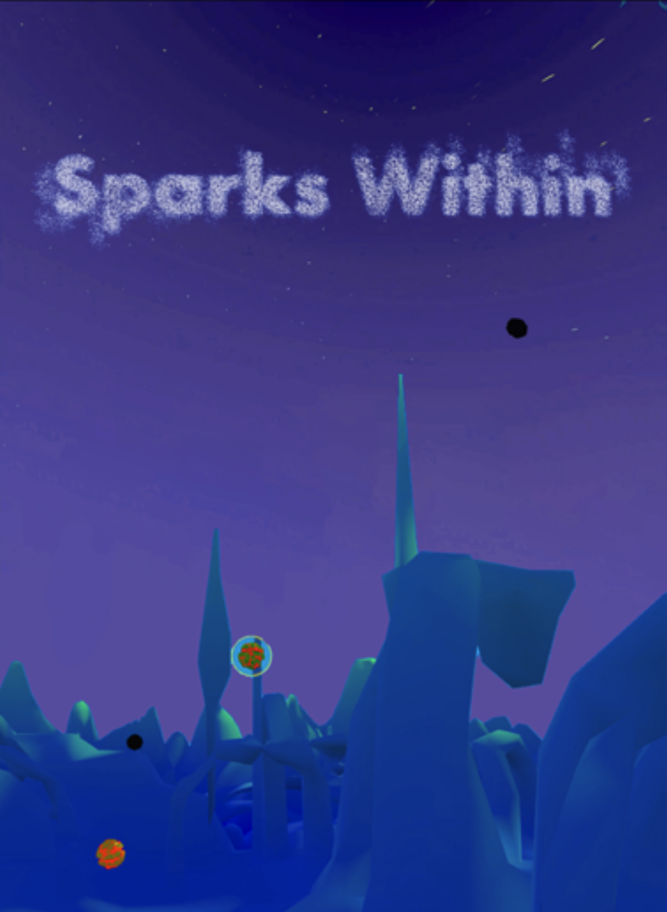

# Sparks Within 💫

_**Compose your path through sound in a world shaped by
your presence.**_

  

## About the Project

### Keywords

_Drifting, Consciousness, universe, projection, sharing, collecting, melody, harmony._

### Description

**Sparks Within** is a meditative VR experience where you explore a sound-based universe as a drifting consciousness. By tuning into the presence of others, you gather their unique sounds and gradually form your own symphony — a sonic reflection of your journey.

Set in another dimension, you drift as a disembodied
consciousness, navigating this realm by tuning into
others — beings whose presence you can hear when
you gaze at them. As you listen, you are invited to
gather their unique sounds. Each collected sound
allows you to move through an evolving environment.
As you travel from entity to entity, the sounds stay
with you, forming a personal symphony — a melody
of the universe. Silence turns to resonance, and the
shifting world around you settles into harmony
— a place of calm, shaped by your presence.
At the heart of Sparks Within is the experience of
paraplegic patients who must adjust to a body that
is still present but limited. Through the concept of
being a disembodied consciousness and sharing
consciousness with other entities, we hope our game
can explore embodiment and perhaps create a space
where saying goodbye becomes a gentle act of trans-
formation rather than loss.

## Gameplay

### Core Mechanics

- 🌫 **Disembodied Navigation**: You drift through a dreamlike world as pure consciousness.
- 👁 **Gaze Interaction**: Look at entities to activate them; a soft aura appears as sound begins to emerge.
- 🙌 **Clap or Hand Gesture**: Bring your hands together to collect an entity’s sound and teleport to it.
- 🎼 **Personal Symphony**: Each collected sound layers into your own evolving environment.

### Advanced Features

- 🖤 Collected entities turn black — look and clap again to **mute** their sound from your symphony.
- 🌌 A **celestial form** takes shape in the sky, visually reflecting your sonic journey.

## Technologies Used

- **Unity6** (VR Development)
- **Shader Graph** (Breathing entity surfaces)
- **VR Hand Tracking & Gaze Detection**
- **Blender** (for the 3D models)
- Visual scripting & trigger-based world progression
- Sound design for the music and the environment

## Inspirations

- Meditative game design
- Non-hierarchical worldbuilding
- Sonic ritual and spiritual embodiment
- Themes of disability, presence, and transformation

## Credits

Created by:

- [**Elisa Bernard**](https://github.com/elisabernaard)
- [**Haneul Farmanfarmaian**](https://github.com/haneulee)
- [**Francesco Le Touzé**](https://github.com/Funkor-dev)

In collaboration between the [Master Media Design](https://head.hesge.ch/en/education/master-media-design) (HEAD – Genève) and [Swiss Paraplegic Group](https://www.swissparaplegicgroup.ch/).

## Presentation

[PDF Presentation](./presskit/head-md1-possible-bodies-Sparks-Within.pdf)

## Demo Video

[Demo Video](https://www.youtube.com/watch?v=HzfDeyrFpCg)
